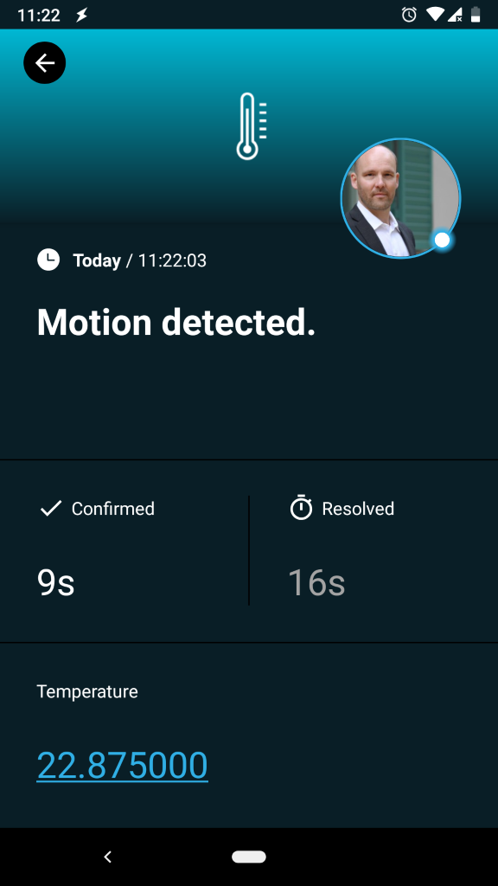
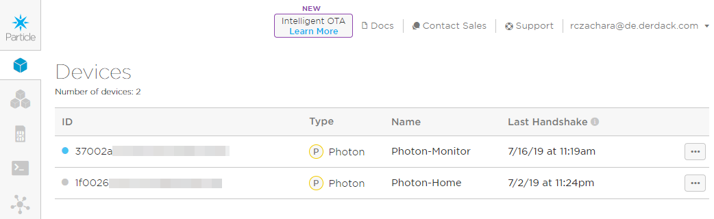
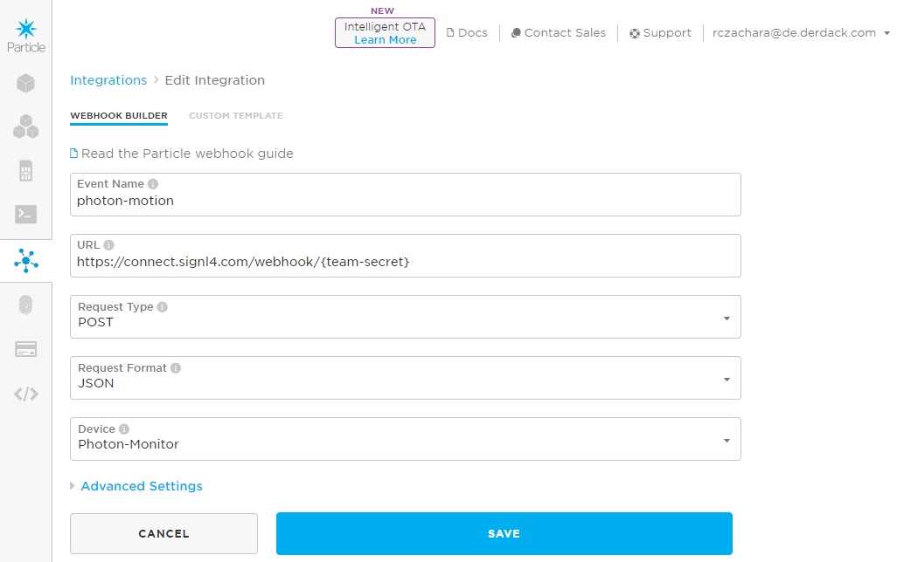
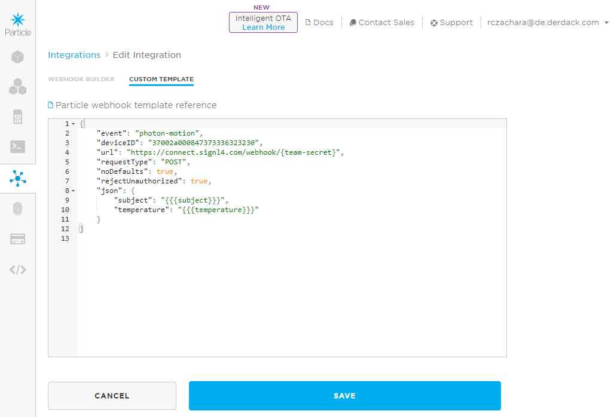
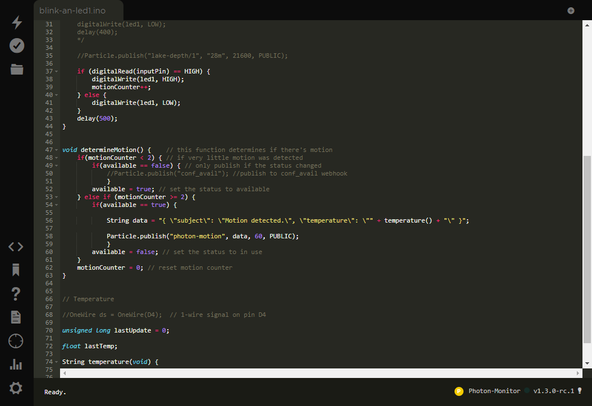

# Mobile Alarmierung per App, SMS und Anruf für Particle

Mobile Alarmierung mit Tracking, Bereitschafts-Planung und Eskalation für Particle.

## Warum SIGNL4

Particle ist eine vollständig integrierte IoT-Plattform, die alles bietet, was Sie für den Einsatz Ihrer IoT-Produkte benötigen, einschließlich Hardware, Software und Konnektivität. Sie können Sensoren oder Umwelt-Daten überwachen, Asset Tracking oder Preventive Maintenance durchführen oder Maschinen-Daten und Supply Chain Management kontrollieren. Die Integration dieser leistungsstarken IoT-Plattform mit SIGNL4 kann Ihren täglichen Betrieb durch die zuverlässige Alarmierung mobiler Teams verbessern, egal wo sich diese befinden.



## So funktioniert es

Alles, was für die Verknüpfung von Particle mit SIGNL4 nötig ist, ist eine Webhooks-Integration in Ihrer Particle-Console und eine Skript-Zeile auf den IoT-Geräten. Dies ermöglicht den Aufruf des SIGNL4-Webhooks und somit die Auslösung eines SIGNL4-Alarms.

## Integration

- Alarmierung von Wartungsteams in SIGNL4 per mobilem Push, Text und Sprache
- Anbindung an SIGNL4 per Email (SMTP API)
- Transparente Quittierung in der mobilen App
- Eskalation von Alarmen wenn eine bestimmte Zeit verstrichen ist
- Team-Kommunikation innerhalb von Alarmen
- Nachvollziehbarkeit der Störungs-Behebung
- Integrierte Bereitschafts-Planung, um die richtigen Personen zur richtigen Zeit zu alarmieren
- Alarmierung über kritische IoT-Status
- Mögliche Zwei-Wege-Integration zur Interaktion mit Geräten

## Szenarien

- Industrielles IoT
- Industrie 4.0
- IoT Service Benachrichtigung
- IoT Geräte-Management
- Produktion, Versorgung, Öl und Gas, Landwirtschaft, etc.

## Und so funktioniert es

### Integration von SIGNL4 mit Particle

In unserem Beispiel integrieren wir ein Partikel Photon Gerät mit einem IR-Bewegungs-Sensor und einem Temperatursensor. Wenn eine Bewegung (z.B. ein Eindringling) erkannt wird, senden wir einen Alarm an unser SIGNL4-Team.

SIGNL4 ist eine mobile App mit der Teams schneller und effektiver auf kritische Alarme, technische Störungen und dringende Service-Aufträge reagieren können. Holen Sie sich die App unter https://www.signl4.com.


### Voraussetzungen

Ein SIGNL4-Konto (https://www.signl4.com)

Ein Particle-Konto (https://console.particle.io)

Ein Particle Maker Kit (https://store.particle.io/collections/shields-and-kits)

#### Integrations-Schritte

1. Gerät zusammen bauen  

In unserem Fall verwenden wir das Particle Maker Kit mit einem Photon-Gerät, um einen IR-Bewegungs-Melder und einen Temperatur-Sensor anzuschließen. Wir verwenden auch eine LED, um die Erkennung einer Bewegung direkt am Gerät anzuzeigen.

Sie können das fertige Gerät auf dem Bild oben sehen. Eine gute Beschreibung zum Anschluss der Sensoren finden Sie hier: https://docs.particle.io/tutorials/hardware-projects/maker-kit.

2. Connect the Device  

Now you can connect your device to the Particle IoT platform. This is easily done by using the Particle app. You can find a full description here: https://docs.particle.io/quickstart/photon.

Nun sehen Sie Ihr neues Gerät in der Particle Console unter Devices: https://console.particle.io/devices.



3. Webhook konfigurieren  

In der Particle Console unter Integrations (https://console.particle.io/integrations) können Sie nun einen neuen Webhook erstellen, um Alarme an SIGNL4 zu senden.

Sie können einen neuen Webhook erstellen und dann die SIGNL4 Webhook-URL verwenden.



Der Teil {team-secret} ist Ihr SIGNL4 Team-Geheimnis.

Unter Custom Template können Sie Ihr JSON-Daten-Template einfügen, welches das Format festlegt, so wie es dann an SIGNL4 gesendet werden soll.



4. Der Code  

Sie können nun die Web IDE unter https://build.particle.io/build aufrufen, um den Code auf Ihre Geräten zu laden.



Die beiden Zeile zum Senden der SIGN4-Alarme sind die folgenden.

```
String data = "{ \"subject\": \"Motion detected.\", \"temperature\": \"" + temperature() + "\" }";

Particle.publish("photon-motion", data, 60, PUBLIC);
```

Zuerst stellen wir die Daten zusammen, die dann Teil der Webhook JSON-Daten werden. Dann senden wir die Daten an den oben von uns erstellten "photon-motion" Webhook.

5. Testen  

Das war es. Sie können nun Ihr IoT-Szenario testen, indem Sie eine Bewegung simulieren. Sie erhalten dann einen Alarm in Ihrer SIGNL4-App.

Ein Beispiel finden Sie auf in GitHub:
https://github.com/signl4/signl4-integration-particle
