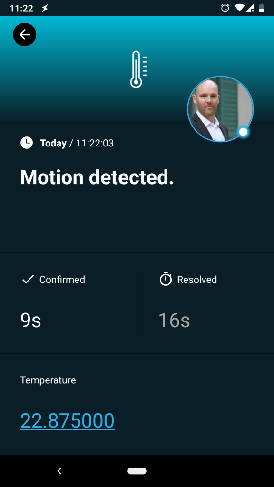
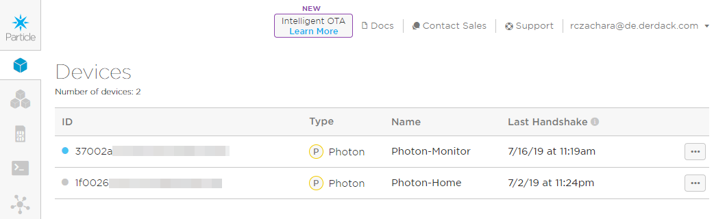
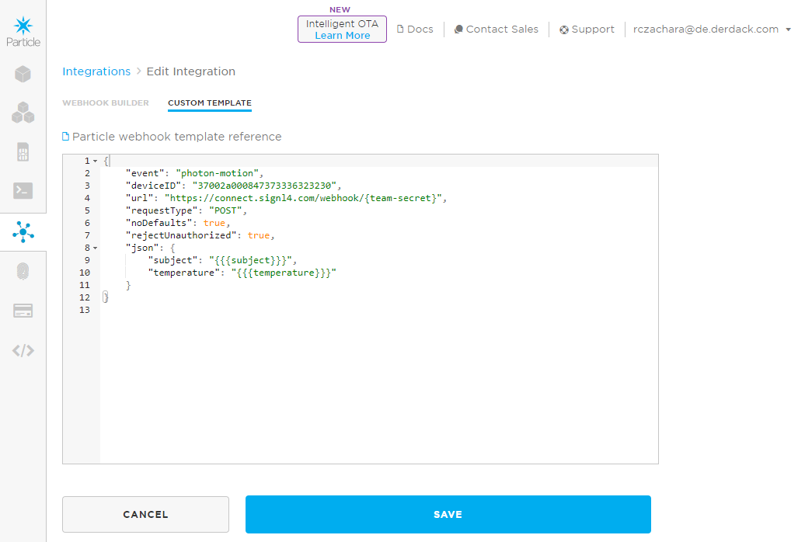

# Mobile alerting with tracking & escalation for Particle

Mobile alerting with tracking, duty planning and escalation for Particle.

## Why SIGNL4

Particle is a fully-integrated IoT platform that offers everything you need to deploy your IoT product, including hardware, software and connectivity. You can monitor sensors or environmental data in the field, do asset tracking, preventive maintenance, gather machine data or use it to improve your supply chain management. Pairing this powerful IoT platform with SIGNL4 can enhance your daily operations with an extension to your team on the shop floor or in the field.



## How it Works

All it takes to pair Particle and SIGNL4 is a Webhooks Integration in your Particle console and one simple line of code deployed to your IoT devices. This allows to call the SIGNL4 webhook and to trigger an according alert.

## Integration Capabilities

- Service engineers alerted via mobile push, text and voice
- Integration with SIGNL4 via webhook or email (SMTP)
- Staff can acknowledge and take ownership for critical events that occur
- Alerts are escalated in case of no response
- Communicate within an alert to address a particular problem
- Tracking and visibility of problem solutions
- Integrated on-call duty planning
- Alert on critical IoT device states
- Two-way integration to interact or set the device state

## Scenarios

- Industrial IoT
- Industry 4.0
- IoT Service Alerting
- IoT Device Management
- IT, Manufacturing, Utility, Oil and Gas, Agriculture, etc.

## How To Integrate

### Integrating SIGNL4 with Particle

In our example we integrate a Particle Photon device with an IR motion sensor and a temperature sensor. Whenever a motion (e.g. an intruder) is detected we send an alert to our SIGNL4 team.

SIGNL4 is a mobile alert notification app for powerful alerting, alert management and mobile assignment of work items. Get the app at https://www.signl4.com.


### Prerequisites

A SIGNL4 (https://www.signl4.com) account

An Particle (https://console.particle.io) account

A Particle Maker Kit (https://store.particle.io/collections/shields-and-kits)

#### Integration Steps

1. Assemble the Device  

In our case we use the Particle Maker Kit with a Photon device to connect an IR motion sensor ans a temperature sensor. We also use an LED to indicate the motion detection directly on the device.

You can see the assembled device on the image above. You can find a good description on how to connect the sensors here: https://docs.particle.io/tutorials/hardware-projects/maker-kit.

2. Connect the Device  

Now you can connect your device to the Particle IoT platform. This is easily done by using the Particle app. You can find a full description here: https://docs.particle.io/quickstart/photon.

Now you can see your new device in the Particle Console under Devices: https://console.particle.io/devices.



3. Configure the Webhook  

In the Particle Console under Integrations (https://console.particle.io/integrations) you can now create a new Webhook in order to send alerts to SIGNL4.

You can create a new Webhook and then use the SIGNL4 webhook URL.


The {team-secret} ist your SIGNL4 team secret.

Under Custom Template you can insert your JSON data template as to be sent to SIGNL4.

```
{
    "event": "photon-motion",
    "deviceID": "37002a000847373336323230",
    "url": "https://connect.signl4.com/webhook/{teamSecret}",
    "requestType": "POST",
    "noDefaults": true,
    "rejectUnauthorized": true,
    "json": {
        "subject": "{{{subject}}}",
        "temperature": "{{{temperature}}}"
    }
}
```



4. Deploy the Code  

You can now go to the Web IDE at https://build.particle.io/build to deploy the code to your device(s).


The two main lines to send the SIGNL4 alert are the following.

```
String data = "{ \"subject\": \"Motion detected.\", \"temperature\": \"" + temperature() + "\" }";

Particle.publish("photon-motion", data, 60, PUBLIC);
```

First, we assemble the date to become part of the webhook JSON data. And second, we send the date to the "photon-motion" Webhook we have created above.

5. Test It  

This is it. You can now test your IoT scenario by simulating a motion. You will then receive an alert in your SIGNL4 app.

You can find a sample in GitHub:
https://github.com/signl4/signl4-integration-particle
